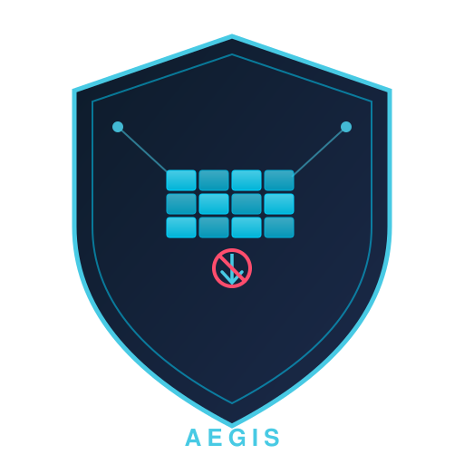

<p align="center">
  
</p>

# Aegis

**Advisory network-egress verdicts and binary-hash attestation for AI agent ecosystems.**

> ⚠️ **Read this first.** Aegis is an *advisory verdict service*, not a network
> control point. It answers "should this connection be allowed?" — it does not
> intercept, proxy, or block traffic itself. The surrounding agent harness must
> honor the verdicts. See [Not yet implemented](#not-yet-implemented) before
> evaluating Aegis as a security control, and
> [docs/THREAT-MODEL.md](docs/THREAT-MODEL.md) for the trust boundaries.

## What Aegis actually is today

Aegis is a small HTTP API (axum + SQLite) that exposes:

### Egress verdicts — `POST /api/egress/check`

An agent (or its harness) asks Aegis whether a destination is permitted *before*
connecting:

```bash
curl -s -X POST http://127.0.0.1:8686/api/egress/check \
  -H 'Content-Type: application/json' \
  -d '{"agent_id": "research-agent", "destination": "https://api.github.com"}'
```

- Allowed: `200` with `{"allowed": true, ...}`.
- Denied: `403` and the attempt is recorded in the audit log with a reason
  (explicit deny rule, no matching allow under default-deny, or missing
  attestation).

Policy semantics: per-agent destination rules where `*.github.com` matches
subdomains only, **deny always wins over allow**, unknown destinations fall
through to the configured `default_policy` (default: `deny`). Host parsing is
hardened against userinfo/trailing-dot/case/IPv6-bracket tricks and fails closed
on ambiguous input.

### Who enforces the block

**The caller does.** Aegis returns a verdict and writes an audit row; it cannot
see or stop the actual network connection. Enforcement happens when your agent
harness, wrapper script, or platform treats a non-`200` response as "refuse to
dial":

```python
verdict = requests.post(f"{AEGIS}/api/egress/check",
                        json={"agent_id": aid, "destination": url})
if verdict.status_code != 200:
    raise Blocked(f"aegis denied {url}: {verdict.text}")
# only now connect
```

If a compromised agent skips the check call, Aegis will never know. There is no
interception layer (yet) that makes checking unavoidable.

### Runtime attestation — self-reported binary hashes

`require_attestation = true` denies egress to any `agent_id` not registered via
the admin-only `POST /api/attestation/attestate`. Registration computes a
SHA-256 of the **caller-supplied `binary_path`** and stores `(agent_id, hash)`.

What this honestly means:

- The hashed file is **self-reported**: whoever registers chooses which file is
  hashed. This proves nothing about what the agent process is actually running.
- `/api/attestation/verify` is an **equality check** ("does this path's hash /
  supplied hash match what was registered?"). Nothing more.
- A stored hash verifies *binary integrity across restarts* only when the
  reference hash was distributed out-of-band (e.g., provisioned by your deploy
  tooling). If the registrant is the agent itself, the hash is just a claim.
- Because registration is admin-gated and the data plane has no per-agent
  authentication, anyone who can reach the API can *reuse* an already-registered
  `agent_id`. Per-agent credentials are on the roadmap.

See [docs/THREAT-MODEL.md](docs/THREAT-MODEL.md) for the full analysis.

### Coarse residency checks — `POST /api/geo/check`

An optional, deliberately crude check: maps a destination's top-level domain to
a coarse region (e.g. `.cn`, `.ru`, EU-country TLDs) and rejects blocked
regions. This is **not real GeoIP** — a `.com` domain hosted anywhere maps to
`US`, and the lookup is trivially influenced by choosing a domain name. Treat it
as a demo-grade heuristic.

### Operational hardening already present

- Admin endpoints (policy CRUD, attestation registration/listing, audit reads)
  require `Authorization: Bearer $AEGIS_ADMIN_TOKEN`, compared in constant time
  via SHA-256 digests. Release builds refuse to start without a token unless
  `AEGIS_INSECURE_DEV=1` is set explicitly.
- Binds to `127.0.0.1` by default; CORS is deny-by-default with an explicit
  origin allowlist.
- Every check (allowed or blocked) is appended to a SQLite `egress_log` with
  timestamp, reason, and status; readable via admin-only endpoints. Rows older
  than `log_retention_days` (default 30) are deleted by an hourly background
  prune and on demand via `POST /api/egress/prune`; prune counters appear in
  `/api/egress/stats`.
- Fail-fast strict config validation; graceful shutdown on SIGINT/SIGTERM;
  blocking DB work stays off the async runtime.

## Not yet implemented

The following are **not in the codebase**, despite earlier versions of this
README claiming them. Do not rely on them:

- **Proxy interception.** Aegis is not an HTTP(S) proxy. There is no `CONNECT`
  handling, no TLS termination/inspection, no transparent traffic capture, and
  no way to force traffic through Aegis. Setting `HTTP_PROXY`/`HTTPS_PROXY` to
  Aegis does nothing useful today.
- **Rate limiting, bandwidth, connection and request-size controls.** The
  config keys `max_request_size_bytes`, `max_connections_per_agent`, and
  `bandwidth_limit_kbps` exist but are **not enforced anywhere**.
- **Real Geo-IP data residency.** Only the TLD heuristic described above.
- **Per-agent authentication** on the data plane (agent identity is a
  client-supplied string).
- **Measured runtime attestation** (hashing the actual executable of the
  calling process) and cryptographic attestation tokens.

Tracking issues describe the plan for each of these.

## Quick Start

```bash
cargo build --release

aegis init                       # writes config.toml (defaults below)

export AEGIS_ADMIN_TOKEN="$(openssl rand -hex 32)"
./target/release/aegis serve --config config.toml
# Listening on 127.0.0.1:8686
```

| Endpoint | Auth | Purpose |
|---|---|---|
| `GET /health` | none | liveness (process up; no dependencies checked) |
| `GET /health/live` | none | liveness probe alias (#6) |
| `GET /health/ready` | none | readiness — 200 only after a live DB round-trip, 503 otherwise (#6) |
| `GET /metrics` | none | Prometheus scrape: decision counter by outcome, decision latency histogram, active-policies gauge (#6) |
| `POST /api/egress/check` | none* | egress verdict (data plane) |
| `POST /api/geo/check` | none* | coarse residency verdict |
| `POST /api/attestation/verify` | none* | hash equality check |
| `GET/POST /api/egress/policies/{agent_id}` | bearer | inspect / add policies |
| `DELETE /api/egress/policies/{agent_id}/{id}` | bearer | remove a policy |
| `GET /api/egress/log?limit=N` | bearer | recent audit rows |
| `GET /api/egress/stats` | bearer | aggregate counts + prune counters |
| `POST /api/egress/prune` | bearer | delete audit rows older than `log_retention_days` |
| `POST /api/attestation/attestate` | bearer | register (agent_id, sha256(path)) |
| `GET /api/attestation/agents` | bearer | registered agents |

\* Data-plane endpoints have **no authentication**; protect them at the network
layer (loopback/firewall) and treat reachability as authorization. See the
threat model.

Audit fidelity (#7): every `egress_log` row records the request's true
metadata — the client IP (direct socket peer; `X-Forwarded-For` is honored
only from `[server] trusted_proxies`), the actual HTTP method, and the buffered
request-body size. Rows also carry the raw XFF chain and user agent for
provenance. Databases created by older builds migrate in place on startup
(versioned via `PRAGMA user_version`; historical rows keep their original
values).

Metrics (#6): `GET /metrics` serves three bounded-cardinality families in
Prometheus text format — `aegis_egress_decisions_total{outcome}` (verdicts of
`/api/egress/check` and `/api/geo/check`, with `outcome` one of `allowed`,
`blocked` for policy denials, or `error` for infrastructure faults),
`aegis_egress_check_latency_seconds{route}` (wall-clock decision latency,
including requests that fail validation), and `aegis_active_policies` (policy
rows, counted in SQLite at scrape time). No per-agent or per-destination
labels are ever exported.

Minimal config (`config.toml`):

```toml
[server]
host = "127.0.0.1"
port = 8686
# Proxies trusted to set X-Forwarded-For (#7). Empty = XFF never honored.
trusted_proxies = []

[database]
path = "/var/lib/aegis/aegis.db"

[egress]
default_policy = "deny"
# Audit rows older than this are pruned hourly (and via POST /api/egress/prune).
log_retention_days = 30

[attestation]
enabled = true
require_attestation = false   # flip to true to gate egress on registration

[geo]
enabled = false
blocked_regions = []
```

## Role in the ecosystem

```
Hive          Patroclus       Relay          Miser        Sentiel        Aegis
─────         ─────────       ─────          ─────        ───────        ─────
Agent         Authz           MCP Proxy      Cost         Observability  Egress
Runtime       Infrastructure  & Tool         Optimization & DLP          Verdicts
& Orchestration                Gateway                    & Compliance   & Attestation
```

Aegis complements Patroclus (which tools may an agent use) and Relay (which MCP
gateways mediate tool calls) by answering which raw network destinations an
agent intends to reach — *provided callers ask and obey*. Integrate by calling
`/api/egress/check` from the agent harness before each outbound connection.

## Status

**Early development.** The documentation above reflects the code as it exists;
features listed under [Not yet implemented](#not-yet-implemented) should be
assumed absent until they appear in this repository with tests.

## License

MIT
